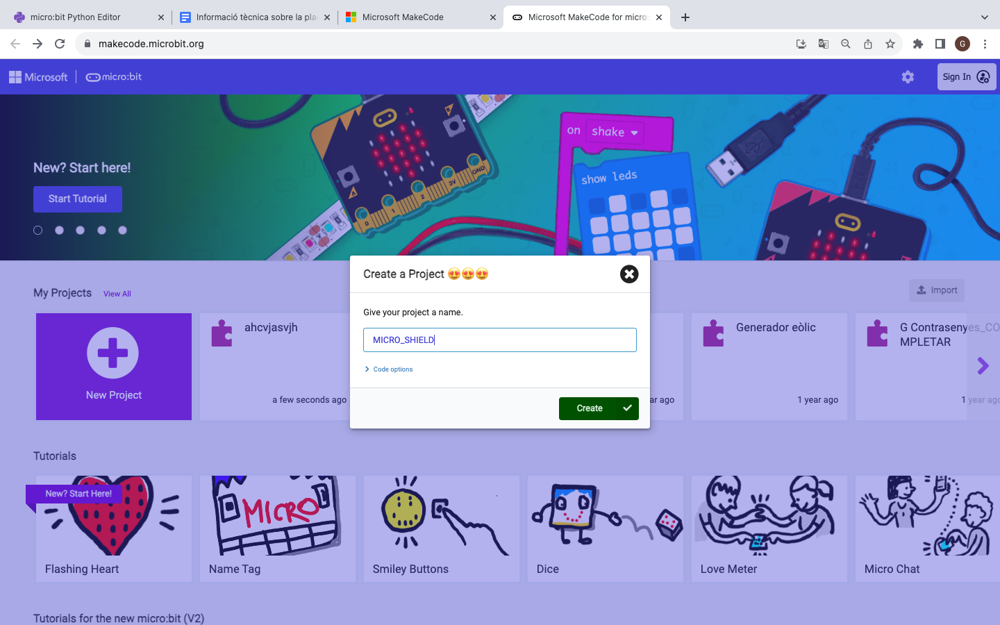
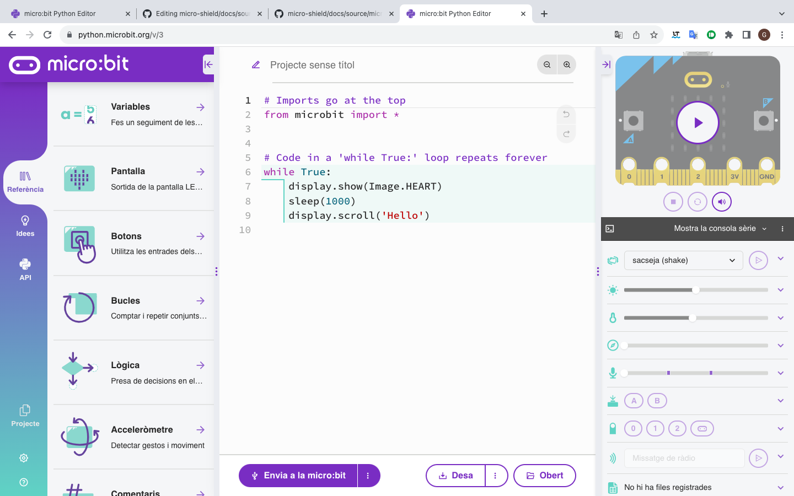

Entorns de programació
=====

Makecode
------------

Microsoft MakeCode és una plataforma gratuïta de codi obert per crear experiències didàctiques sobre informàtica, que ofereixen un mètode progressiu per introduir-se a la programació.

Microsoft MakeCode és un editor en línia basat a la web que us permet crear programes utilitzant blocs amb funcions específiques. 

També es coneix com a llenguatge de programació gràfic i és compatible amb tots els navegadors i plataformes web moderns.

Python editor
------------

Python és un excel·lent primer llenguatge basat en text per aprendre. Les seves instruccions i sintaxi es basen en llenguatge natural, cosa que fa que el codi sigui fàcil de llegir, comprendre i modificar.

A més d'utilitzar-se àmpliament a l'educació, s'utilitza a la indústria, especialment a les àrees de ciència de dades i aprenentatge automàtic. Python no només és usat pels desenvolupadors de programari, sinó també per persones que treballen en camps tan diversos com la medicina, la física i les finances.
