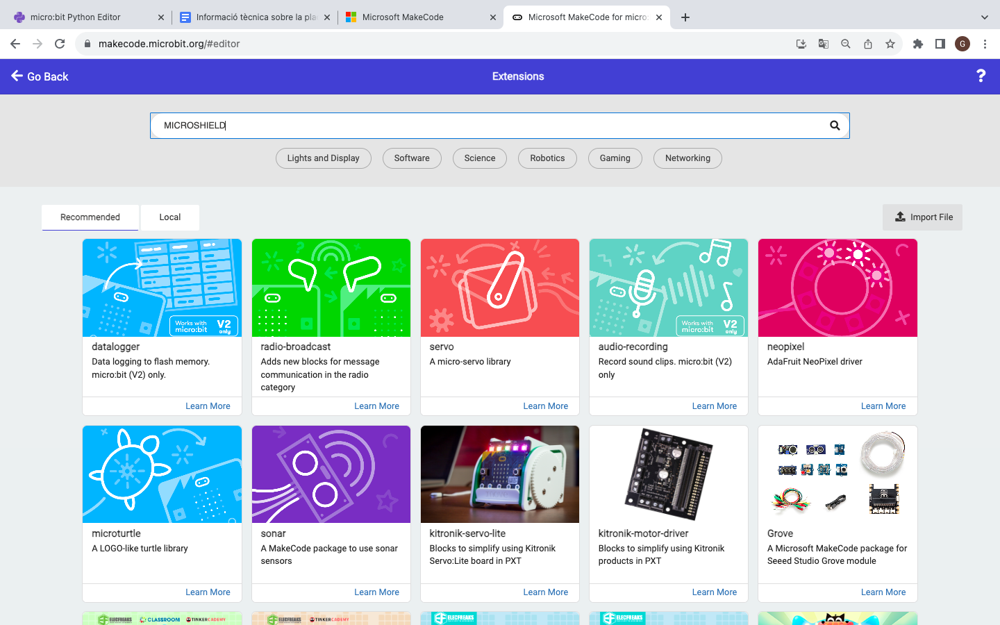
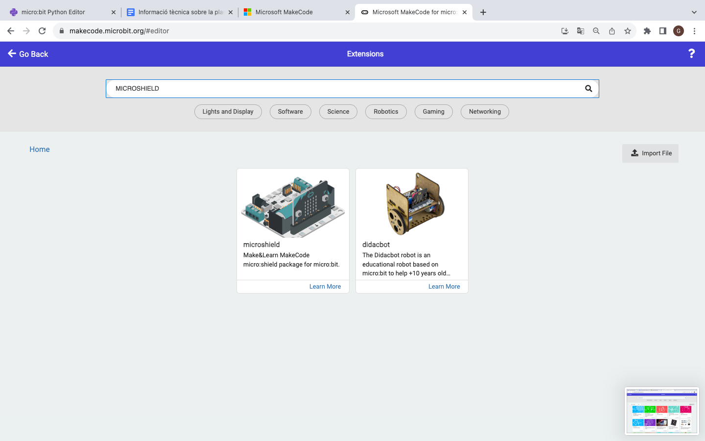
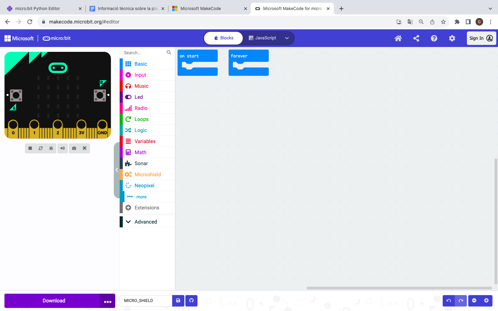
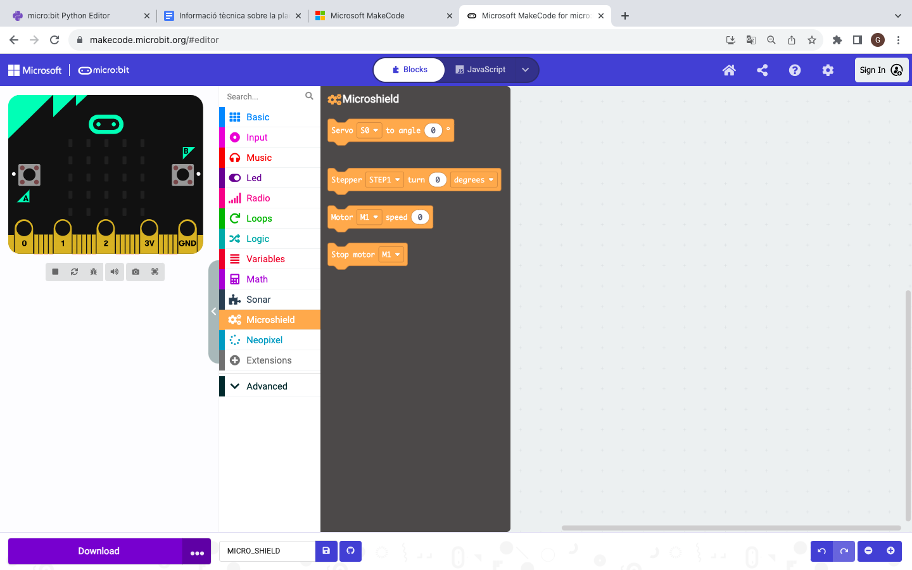
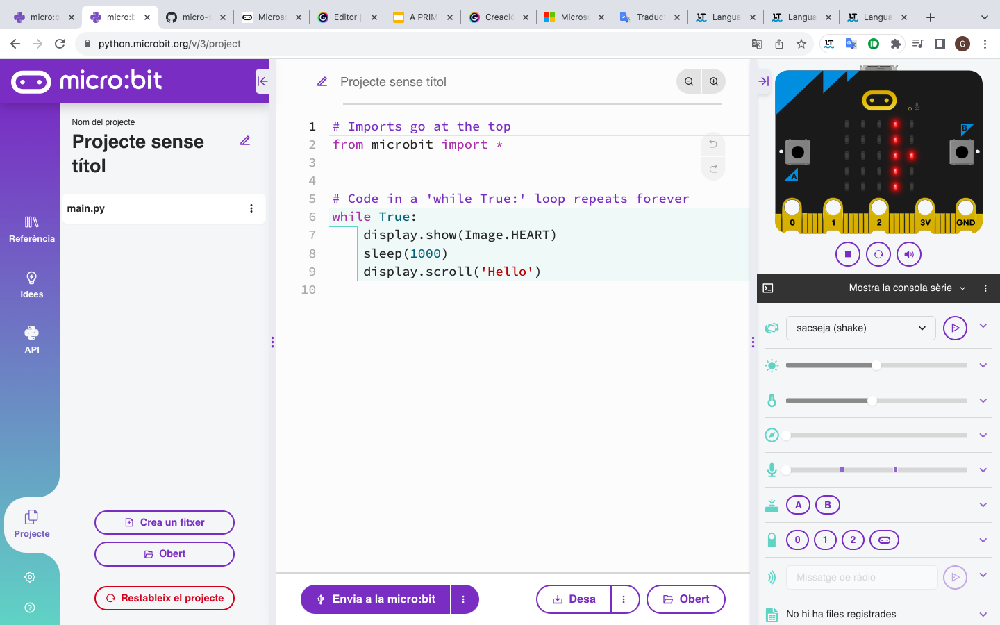
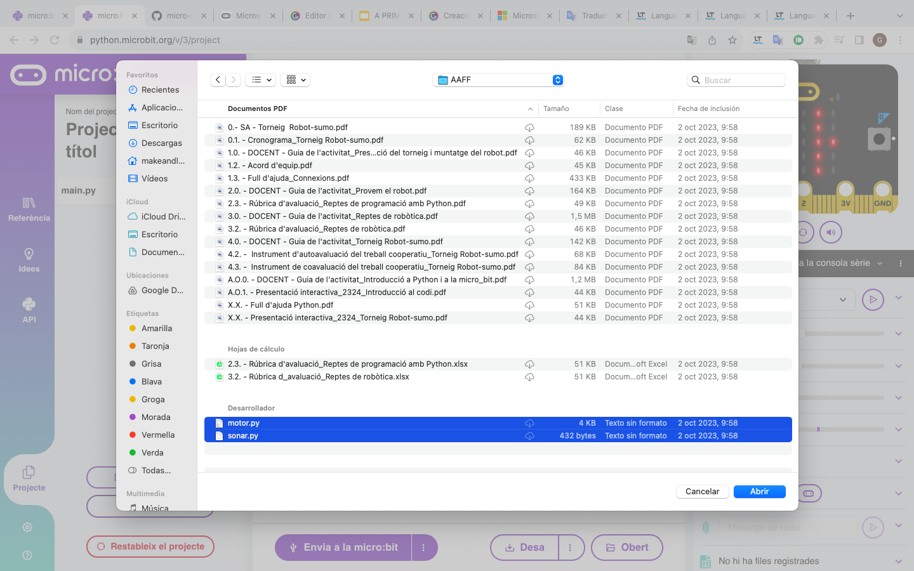

Entorns de programació
=====

Makecode
------------
.. image:: INICIO_3.png
  :width: 400
  :alt: Entorn de programació microsoft makecode per a micro:bit
  :align: center

`Microsoft MakeCode <https://makecode.microbit.org/#>`_ per a micro:bit és un editor en línia basat a la web que us permet crear programes utilitzant blocs amb funcions específiques. 

També es coneix com a llenguatge de programació gràfic i és compatible amb tots els navegadors i plataformes web moderns.

La placa micro:shield conté elements complexes de programar i que podem utilitzar fàcilment mitjançant la seva llibreria que es pot importar seguint els passos indicats a continuació.

Primer anem a l'apartat de blocks "extensions" -> "+ extensions"

.. image:: LIBRERIAS_0.png
  :width: 400
  :alt: Espai d'instal·lació de llibreries en microsoft makecode per a micro:bit
  :align: center

Busquem la llibreria MICROSHIELD

Veurem que apareixen dues extensions. Les dues inclouen la llibreria de la micro:shield. La de micro:shield és la més simple mentre que la de didacbot inclou funcions que ens poden ser útils per al moviment d'un robot de dues rodes.

Cliquem sobre la llibreria que volem importar

Blocks llibreria micro:shield

Blocks llibreria didacbot

Python editor
------------

Python és un llenguatge basat en text. Les seves instruccions i sintaxi es basen en llenguatge natural, cosa que fa que el codi sigui fàcil d'escriure, llegir, comprendre i modificar.

Disposem de l'entorn de programació `python per a micro:bit <https://python.microbit.org/v/3>`_ per poder programar aquesta placa fàcilment.

.. image:: INICIO_5.png
  :width: 400
  :alt: Visualització de l'entorn de programació python de micro:bit

A més d'utilitzar-se àmpliament a l'educació, s'utilitza a la indústria, especialment a les àrees de ciència de dades i aprenentatge automàtic. Python no només és usat pels desenvolupadors de programari, sinó també per persones que treballen en camps tan diversos com la medicina, la física i les finances.

La placa micro:shield conté elements complexes de programar i que podem utilitzar fàcilment mitjançant la seva llibreria que es pot importar seguint els passos indicats a continuació.

Cliquem a l'apartat projecte de la part esquerra de l'entorn

Busquem les llibreries en l'ordinador i cliquem a obrir

Se'ns mostrarà un missatge confirmant que volem fer amb els arxius. Hem de sel·leccionar e4l paper amb l'engranatge i sel·leccionar "afegir arxiu". Una vegada seleccionat en tots els arxius oberts podem clicar a confirmar

(imatge)

Des del document main.py podrem ara utilitzar les funcions de la llibreria.

