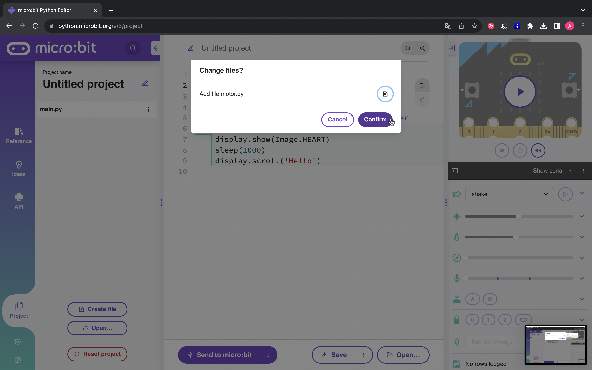

Entorns de programació
=====

Makecode
------------

|pic1|  |pic2|

.. |pic1| image:: img/ep/INICIO_1.png
   :width: 48%

`Microsoft MakeCode <https://makecode.microbit.org/#>`_ per a micro:bit és un editor en línia basat a la web que permet crear programes utilitzant blocs amb funcions específiques. 

També es coneix com a llenguatge de programació gràfic i és compatible amb tots els navegadors i plataformes web moderns.

La placa micro:shield conté elements complexes de programar i que podem utilitzar fàcilment mitjançant la seva llibreria que es pot importar seguint els passos indicats a continuació.

Primer anem a l'apartat de blocs *+ extensions*

Busquem la llibreria MICROSHIELD

.. image:: img/ep/LIBRERIAS_1.png
  :width: 400
  :alt: Cerca de llibreria en microsoft makecode per a micro:bit
  :align: center

Veurem que apareixen dues extensions. Les dues inclouen la llibreria de la micro:shield. La de micro:shield és la més simple mentre que la de didacbot inclou funcions que ens poden ser útils per al moviment d'un robot de dues rodes.

.. image:: img/ep/LIBRERIAS_2.png
  :width: 400
  :alt: Resutat de cerca llibreries en microsoft makecode per a micro:bit
  :align: center

Cliquem sobre la llibreria que volem importar

La llibreria microshield inclou els blocs per poder controlar motors pas a pas, servos i motors DC.

.. image:: img/ep/LIBRERIAS_4.png
  :width: 400
  :alt: Visualització blocs llibreria microshield
  :align: center

La llibreria didacbot inclou blocs que ens poden ser útils per al control d'un robot de dues rodes utilitzant la micro:sield ja sigui amb motors DC o motors pas a pas.

Python editor
------------

Python és un llenguatge basat en text. Les seves instruccions i sintaxi es basen en llenguatge natural, cosa que fa que el codi sigui fàcil d'escriure, llegir, comprendre i modificar.

Disposem de l'entorn de programació `python per a micro:bit <https://python.microbit.org/v/3>`_ per poder programar aquesta placa fàcilment.

La placa micro:shield conté elements complexes de programar i que podem utilitzar fàcilment mitjançant la seva llibreria que es pot importar seguint els passos indicats a continuació. 

Per utilitzar els motors amb la placa micro:shield haurem de descarregar aquest llibreria.

:download:`Llibreria motor.py <llibreries/motor.py>`

Cliquem a l'apartat projecte de la part esquerra de l'entorn

Busquem les llibreries en l'ordinador i cliquem a obrir

Se'ns mostrarà un missatge confirmant que volem fer amb els arxius. Hem de sel·leccionar el paper amb l'engranatge i sel·leccionar "afegir arxiu". Una vegada seleccionat això en tots els arxius oberts podem clicar a confirmar.

|pic1|  |pic2|

|pic1|  |pic2|

.. |pic2| image:: img/ep/INICIO_8.png
   :width: 48%

Finalment importem la llibreria al main.py afegint la líniaa d'importació  
.. code-block:: python 
  import motor.py

Des del document main.py podrem ara utilitzar les funcions de la llibreria.

Les funcions de la llibreria són:

- motor.DC(pin, velocitat)
- motor.servo(pin, posició)
