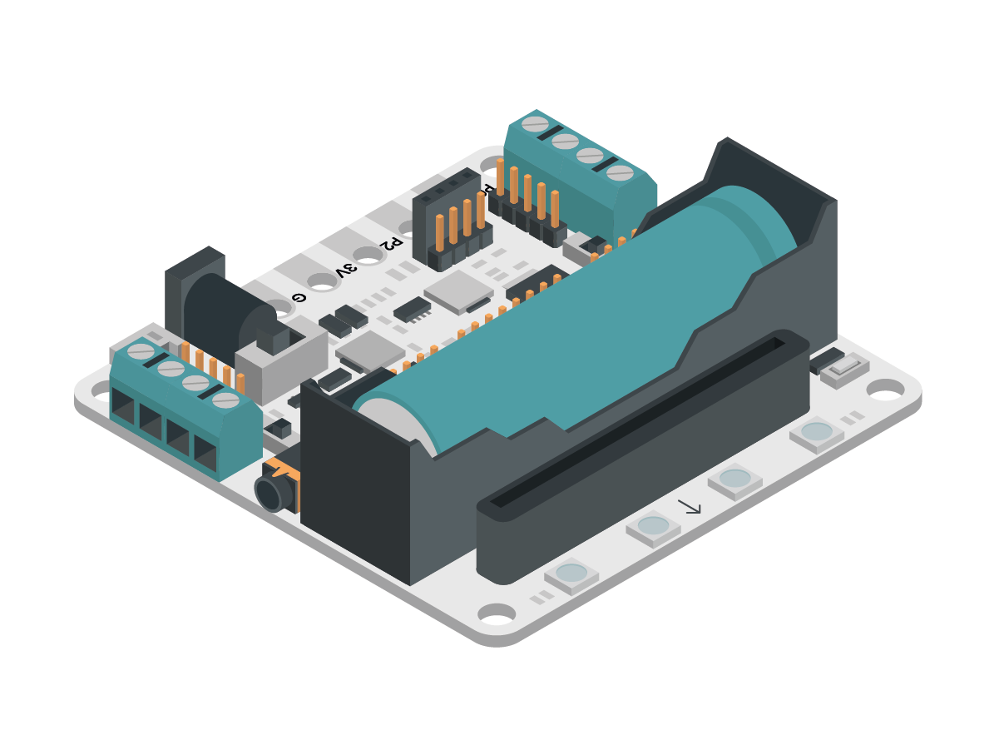
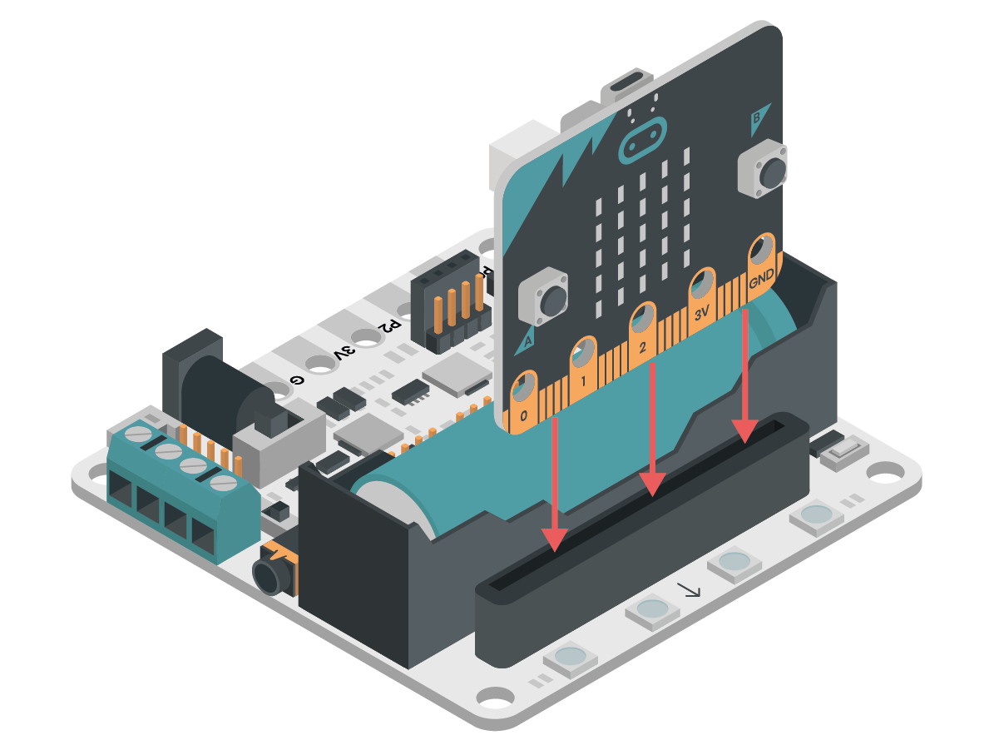
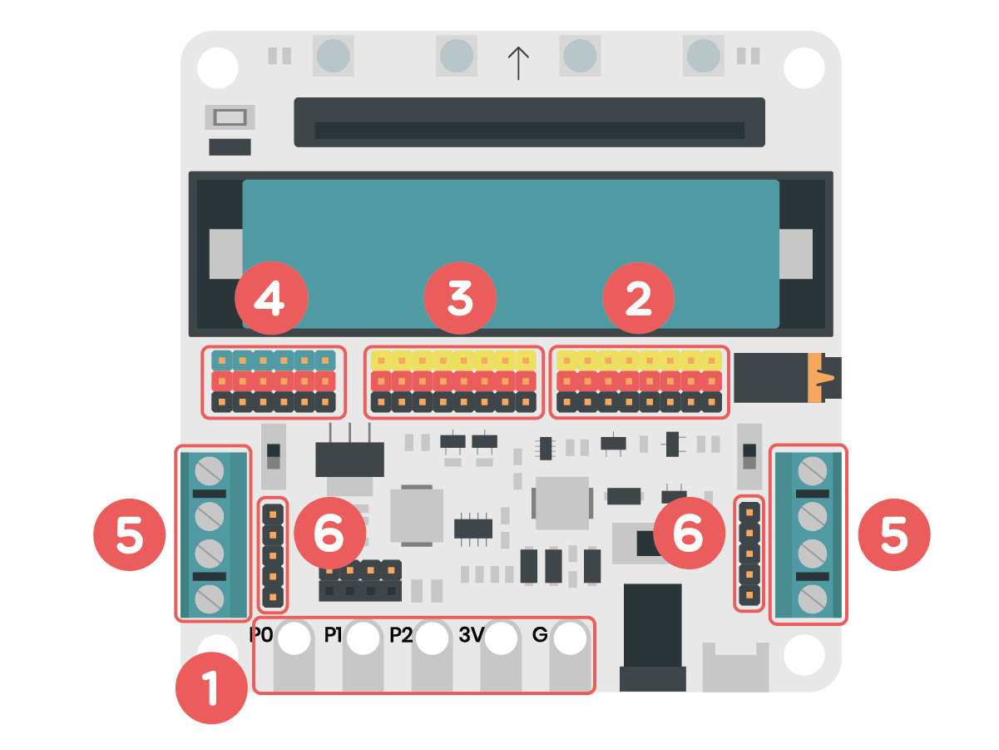
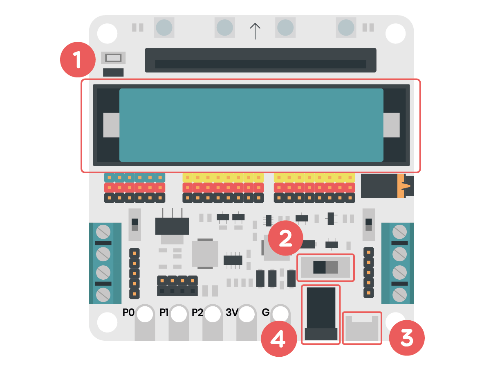
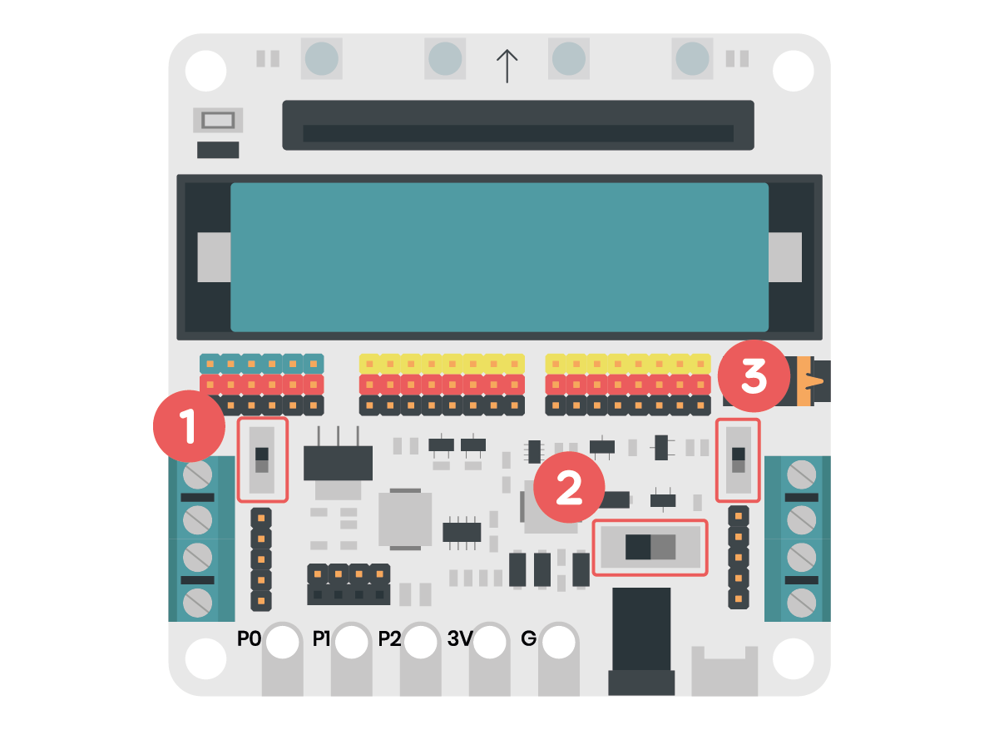
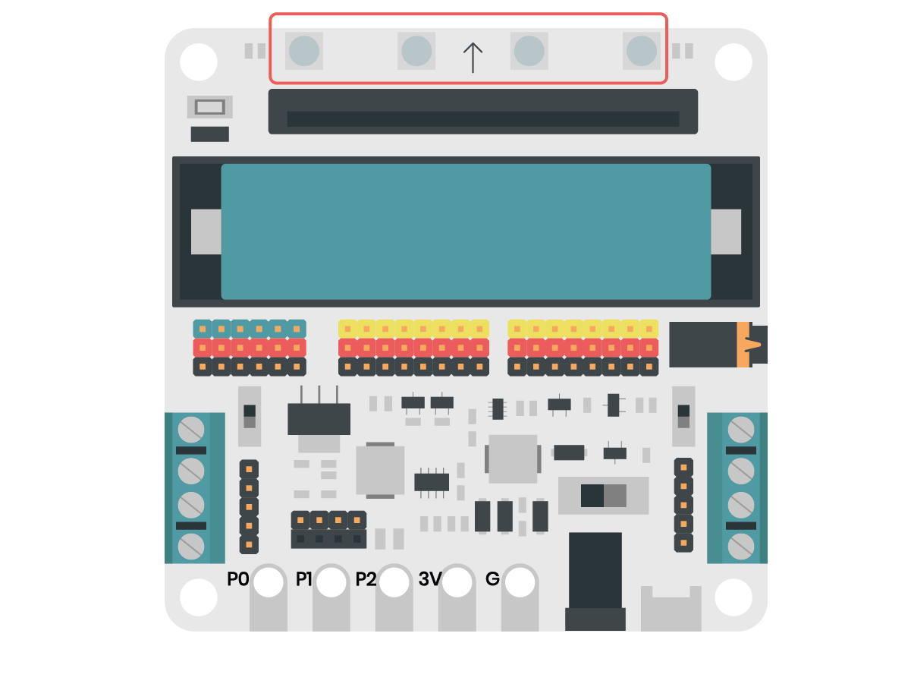
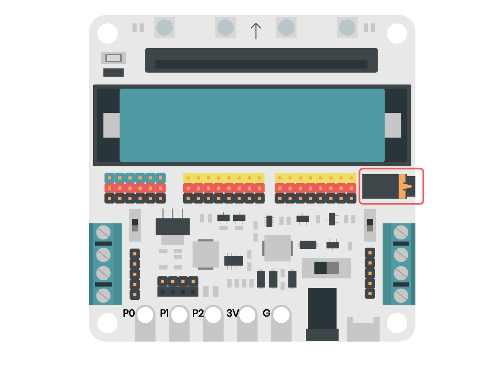

Informació general de la placa
==============================

Descripció
----------

La *micro:shield* és una placa d’extensió que permet ampliar les possibilitats de la *micro:bit* fent més accessibles els pins d’aquesta amb diferents tipus de connectors.

A més, aquesta placa d’extensió, incorpora diferents components que la fan ideal per a l’aula. Si mirem la placa, des de dalt, podem observar tots els components que s’especifiquen en aquestes pàgines.

Les dimensions de la placa i els seus forats permeten que aquesta es pugui muntar sobre peces tipus LEGO.

Dimensions
----------

80 x 80 mm

Connexions
----------
La *micro:shield* és una placa d'extensió de la placa *micro:bit*, aquesta es col·loca en la seva ranura frontal de manera que la seva matriu de leds no quedi al mateix costat de la pantalla com podem veure a continuació.

|pic1|  |pic2|

.. |pic2| image:: generalmicrobitperspectiva.png
   :width: 48%

La placa *micro:bit* disposa de 20 pins de connexió dels quals només 3 són fàcilment accessibles. La *micro:shield*, en canvi, ofereix connectors de diferents tipus per poder accedir fàcilment a tots els pins de la *micro:bit* amb diferents voltatges i amb diferents components externs.

    1. Connectors *alligator*
    2. Pins GVS 3,3 V
    3. Pins GVS servomotors
    4. Pins GVS 3,3 V - 5 V
    5. Ports motors DC
    6. Connectors motors pas a pas

Bateria
-------

La *micro:shield* disposa d’una bateria recarregable de 2200 mAh 3.7 V que es pot carregar mitjançant un cable USB.

La *micro:shield* disposa d’un connector jack per poder connectar una alimentació externa a la placa amb un voltatge d’entre 6,5 i 9 V. 

    1. Bateria recarregable
    2. Interruptor general ON/OFF
    3. Connector USB per carregar la bateria
    4. Connector jack per d’alimentació externa (6,5-9 V)

Interruptors
----------

La *micro:shield* disposa de 3 interruptors que tenen diferent utilitat.

    1. Interruptor 3,3V-5V
    2. Interruptor ON/OFF
    3. Interruptor PIN0-Buzzer

LEDS
----------

La *micro:shield* té 4 LEDs Neopixel situats davant de la ranura on s'insereix la micro:bit. Aquests LEDs, que estan connectats internament a la placa a través del pin P16, es programen igual que una tira de LEDs Neopixel.

Brunzidors
----------

La *micro:shield* disposa d’un brunzidor i un connector jack connectats al pin P0. Si no hi ha res connectat al port jack quan programem música sonarà el brunzidor intern de la placa. En connectar uns auriculars o un altaveu al port jack, el brunzidor deixarà de funcionar i sentirem la música pel perifèric connectat.

