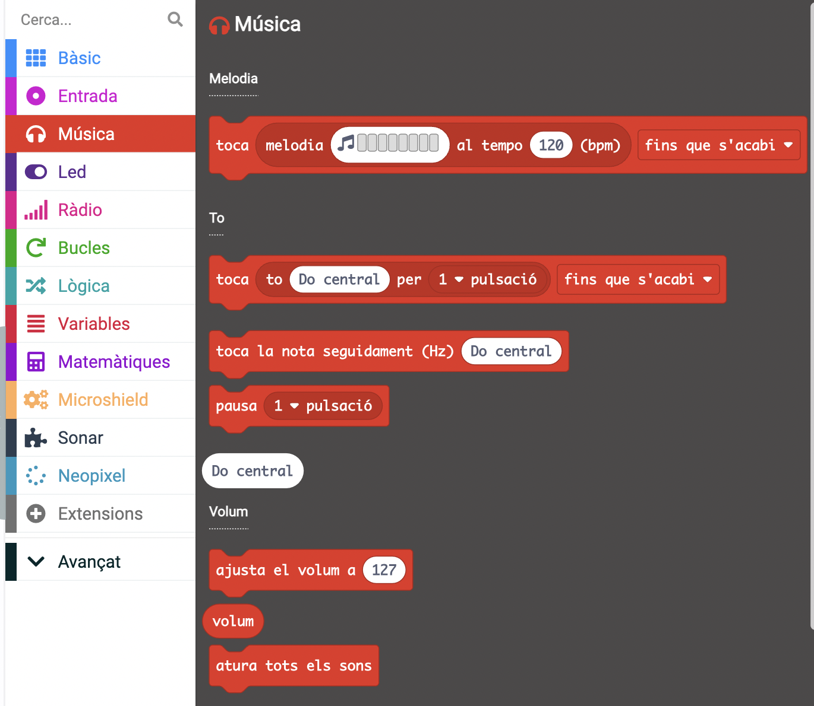
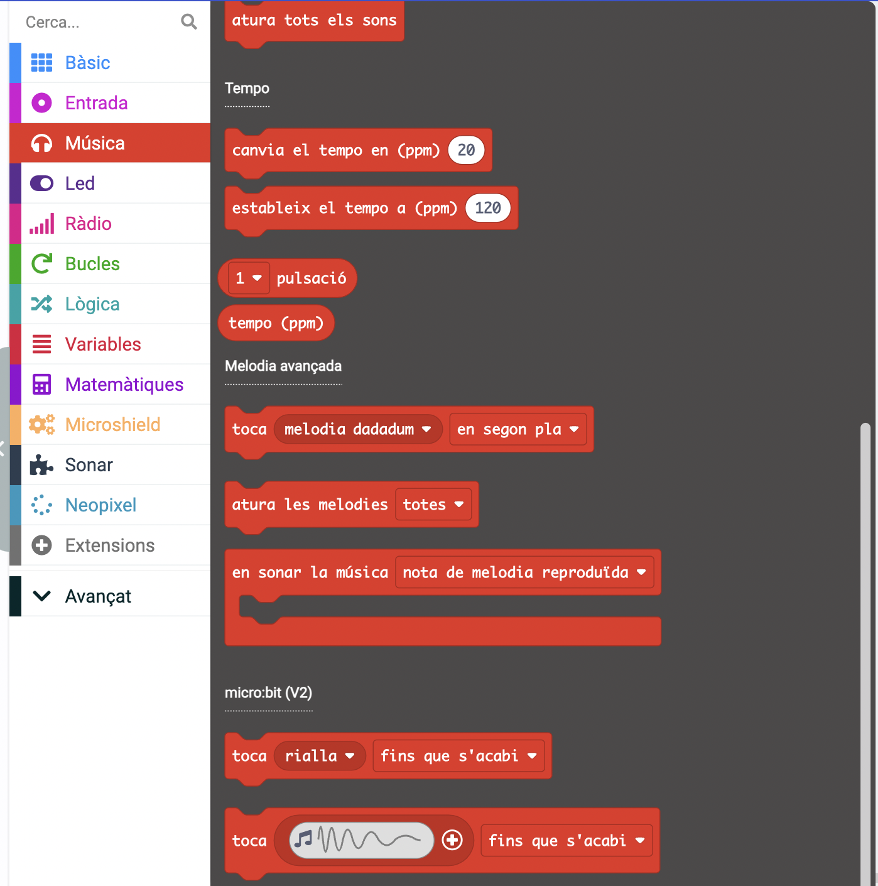
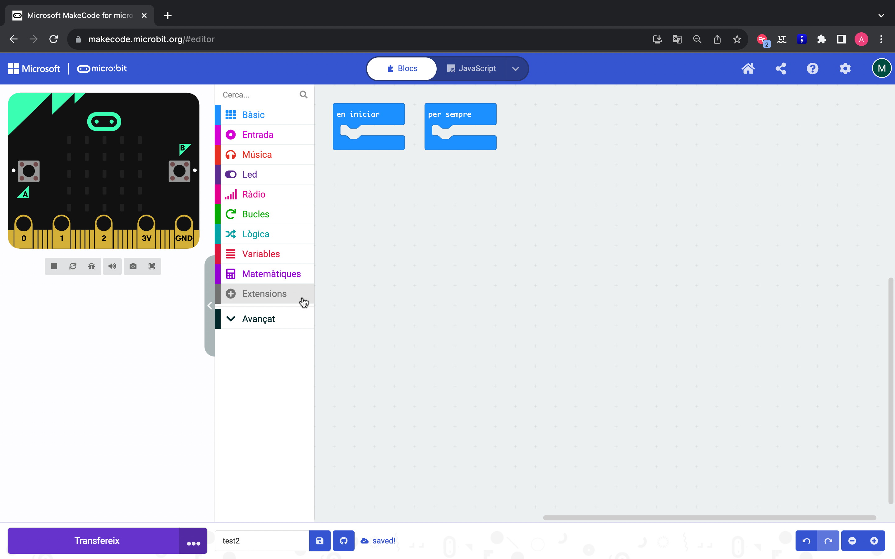
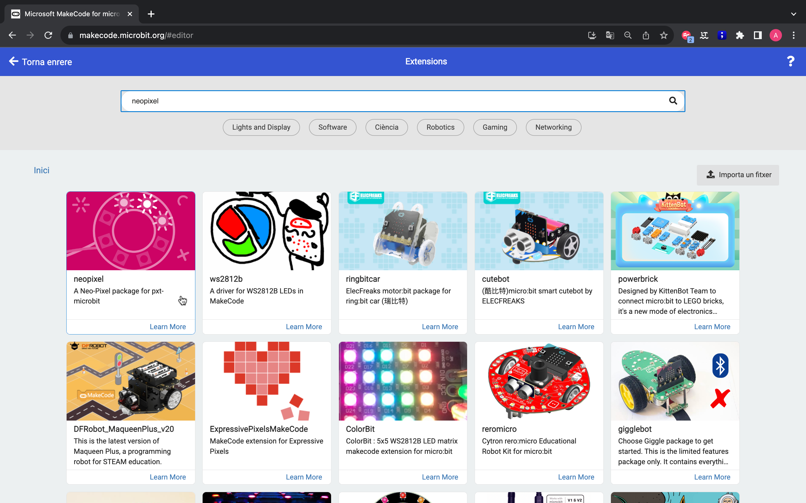
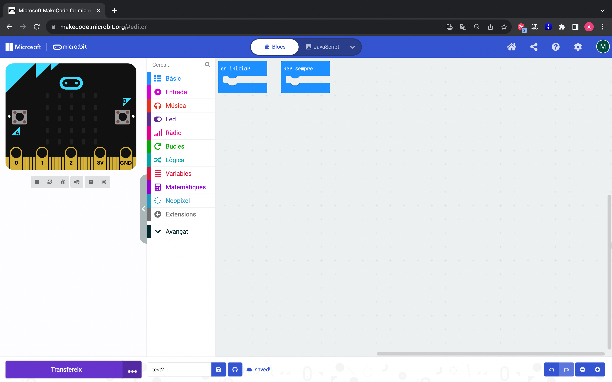

Programació dels elements de la placa
=====

Brunzidor
------------

El brunzidor de la *micro:shield* està connectat al pin 0 de la placa *micro:bit*. En les plaques *micro:bit V2* ja disposem de brunzidor integrat, en el cas de les plaques *micro:bit V1* s'utilitzarà el brunzidor de la *micro:shield*.

Per programar aquest element utilitzarem els blocs de l'apartat *música*.

|pic1|  |pic2|

Seguidament, podem veure un exemple de programació perquè soni una melodia amb el brunzidor.

.. raw:: html

  
<iframe style="position:absolute;top:0;left:0;width:100%;height:100%;" src="https://makecode.microbit.org/---codeembed#pub:S40216-52246-16388-51582" allowfullscreen="allowfullscreen" frameborder="0" sandbox="allow-scripts allow-same-origin"></iframe>

LEDS RGB
------------

Els leds de la placa *micro:shield* es troven a la part frontal de la mateixa. Disposem de 4 leds RGB connectats al pin 16 de la *micro:bit*. Aquests leds es programen mitjançant la llibreria neopixel que podem trobar a *extensiones*. Instal·lant la llibreria de la *micro:shield* també se'ns importarà per defecte la llibreria neopixel.

Importació de la llibreria
------------
Clicar a l'apartat de programació *extensiones*.

Escriure el nom de l'extensió, neopixel, en el cercador.

Seleccionar la llibreria.

Ja tenim els blocs disponibles a l'apartat de neopixel.

Programació dels leds
------------
El primer pas essencial és declarar els leds que tenim connectats i els pins en què es troben amb el primer bloc de l'apartat neopixel.

.. raw:: html

  
<iframe style="position:absolute;top:0;left:0;width:100%;height:100%;" src="https://makecode.microbit.org/---codeembed#pub:S79837-81525-51896-16811" allowfullscreen="allowfullscreen" frameborder="0" sandbox="allow-scripts allow-same-origin"></iframe>

Després de programar això ja podem programar els leds de la *micro:shield*. Seguidament trobem diferents exemples:

- Programa d'arc de sant martí

.. raw:: html
  
  
<iframe style="position:absolute;top:0;left:0;width:100%;height:100%;" src="https://makecode.microbit.org/#pub:S07748-02339-99765-82302" frameborder="0" sandbox="allow-popups allow-forms allow-scripts allow-same-origin"></iframe>

- Encendre els 4 leds d'un color

.. raw:: html

  
<iframe style="position:absolute;top:0;left:0;width:100%;height:100%;" src="https://makecode.microbit.org/#pub:S93999-14672-29691-04469" frameborder="0" sandbox="allow-popups allow-forms allow-scripts allow-same-origin"></iframe>

- Encendre 1 led d'un color

.. raw:: html

  
<iframe style="position:absolute;top:0;left:0;width:100%;height:100%;" src="https://makecode.microbit.org/#pub:S57782-00626-66463-79255" frameborder="0" sandbox="allow-popups allow-forms allow-scripts allow-same-origin"></iframe>

- Pampallugues de colors

.. raw:: html

  
<iframe style="position:absolute;top:0;left:0;width:100%;height:100%;" src="https://makecode.microbit.org/#pub:S97665-55675-31425-53030" frameborder="0" sandbox="allow-popups allow-forms allow-scripts allow-same-origin"></iframe>

