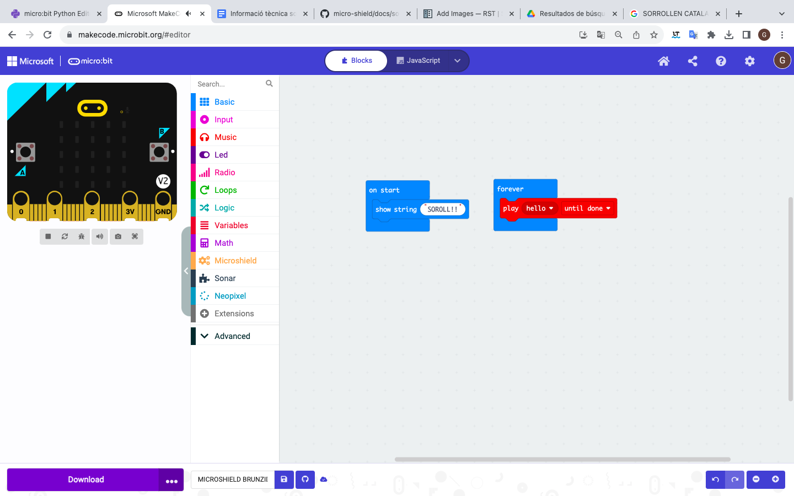
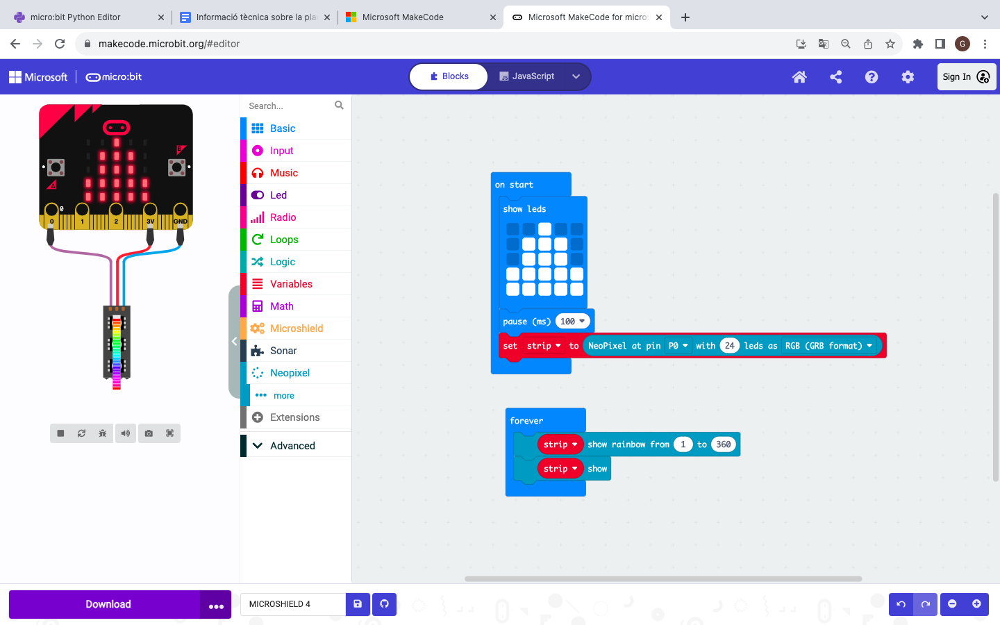

Programació elements de la placa
=====

Brunzidor
------------

El brunzidor de la micro:shield està connectat al pin 0 de la placa micro:bit. En les plaques V2 ja disposem de brunzidor integrat a la placa micro:bit. En el cas de les micro:bits V1 s'utilitzarà el brunzidor de la micro:shield.

Per programar aquest element utilitzarem els blocks de l'apartat music.

(imatge)

Seguidament podem veure un exemple de programació perque soni una melodia amb el brunzidor.

.. raw:: html

  
<iframe style="position:absolute;top:0;left:0;width:100%;height:100%;" src="https://makecode.microbit.org/---codeembed#pub:S40216-52246-16388-51582" allowfullscreen="allowfullscreen" frameborder="0" sandbox="allow-scripts allow-same-origin"></iframe>

LEDS RGB
------------

En aquest exemple farem que els nostres leds de la MicroShield es tornin com un arcoiris, també dibuixar un cos amb el logo microbit.

.. raw:: html

  
<iframe style="position:absolute;top:0;left:0;width:100%;height:100%;" src="https://makecode.microbit.org/---run?id=S43012-57089-21632-29022" allowfullscreen="allowfullscreen" sandbox="allow-popups allow-forms allow-scripts allow-same-origin" frameborder="0"></iframe>

