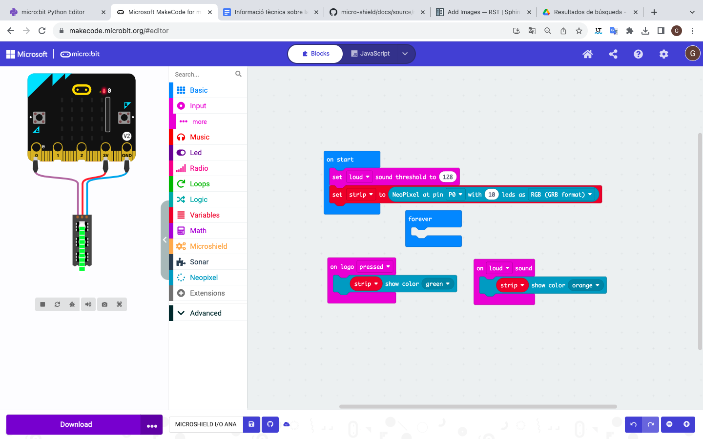
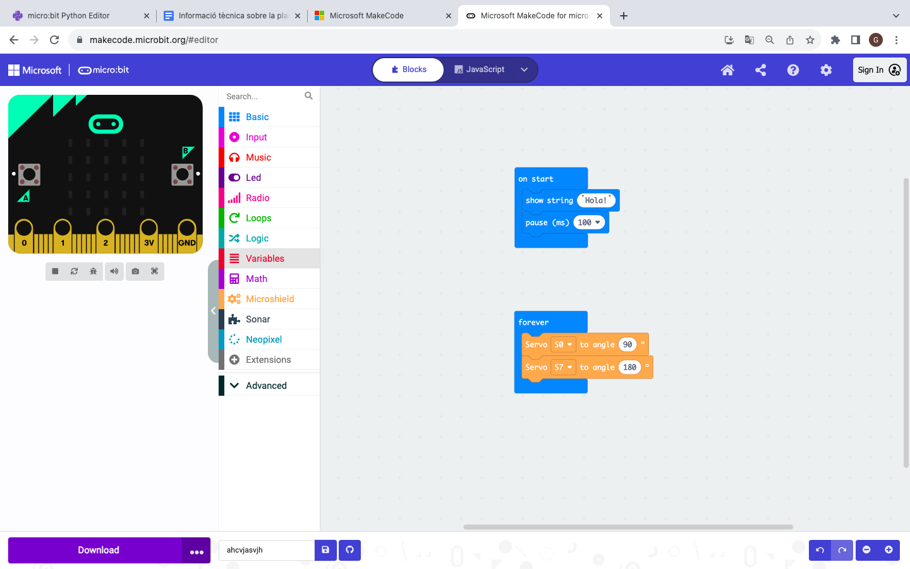
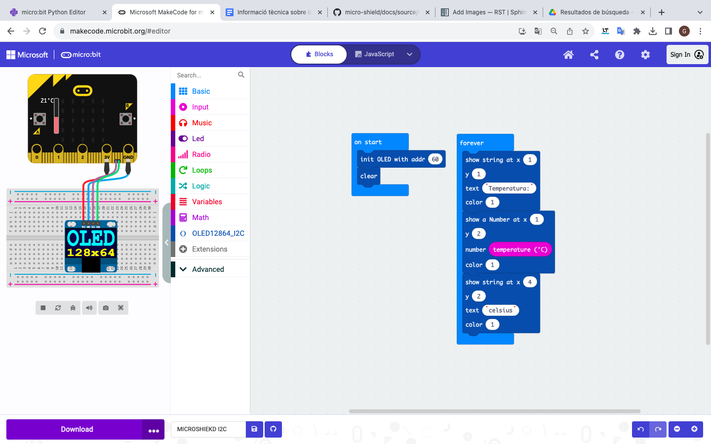

Programació d'elements en els diferents connectors
=====

Entrades/sortides digitals
------------

.. image:: IODIGITAL.png
  :width: 400
  :alt: IO DIGITAL

<iframe style="position:absolute;top:0;left:0;width:100%;height:100%;" src="https://makecode.microbit.org/---run?id=S16112-11337-99351-89819" allowfullscreen="allowfullscreen" sandbox="allow-popups allow-forms allow-scripts allow-same-origin" frameborder="0"></iframe>

Entrades/sortides analògiques
------------

<iframe style="position:absolute;top:0;left:0;width:100%;height:100%;" src="https://makecode.microbit.org/---run?id=S71262-27680-97557-44981" allowfullscreen="allowfullscreen" sandbox="allow-popups allow-forms allow-scripts allow-same-origin" frameborder="0"></iframe>

Servos
------------

Motor DC
------------

.. image:: MOTOR_DC.png
  :width: 400
  :alt: MOTOR DC

Motor pas a pas
------------

.. image:: MOTOR_PAP.png
  :width: 400
  :alt: MOTOR PAP

<iframe style="position:absolute;top:0;left:0;width:100%;height:100%;" src="https://makecode.microbit.org/---run?id=S00993-50067-73080-94146" allowfullscreen="allowfullscreen" sandbox="allow-popups allow-forms allow-scripts allow-same-origin" frameborder="0"></iframe>

I2C
------------

<iframe style="position:absolute;top:0;left:0;width:100%;height:100%;" src="https://makecode.microbit.org/---run?id=S16557-83647-42940-80006" allowfullscreen="allowfullscreen" sandbox="allow-popups allow-forms allow-scripts allow-same-origin" frameborder="0"></iframe>

