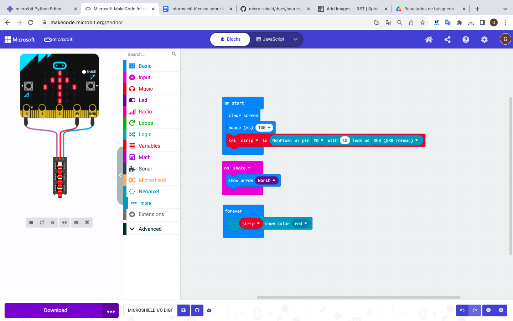
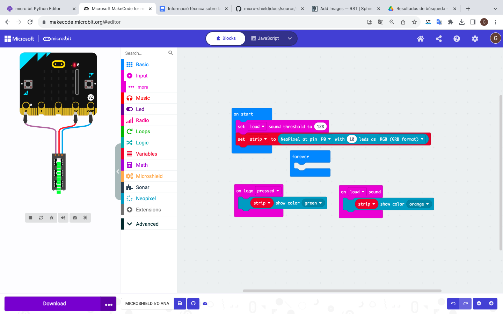

Programació d'elements en els diferents connectors
=====

Entrades/sortides digitals
------------

Entrades/sortides analògiques
------------

Servos
------------

.. image:: SERVOS.png
  :width: 400
  :alt: SERVOMOTORES

Motor DC
------------

.. image:: MOTOR DC.png
  :width: 400
  :alt: MOTOR DC

Motor pas a pas
------------

.. image:: MOTOR PAP.png
  :width: 400
  :alt: MOTOR PAP

I2C
------------

.. image:: I2C.png
  :width: 400
  :alt: I2C

