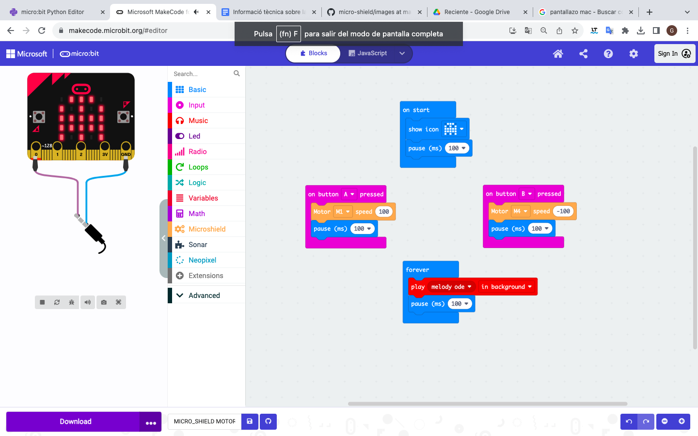
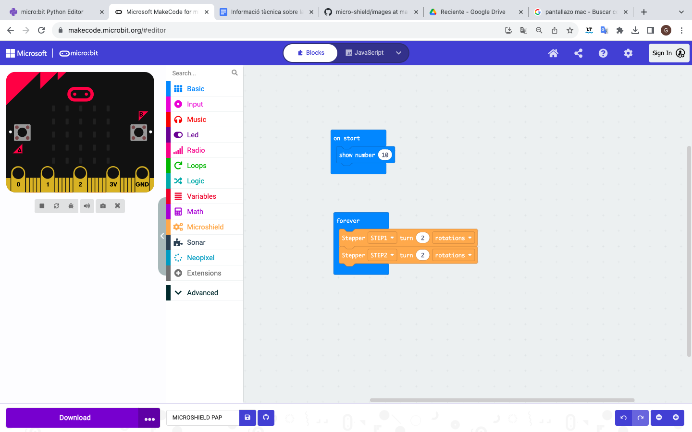

Programació d'elements en els diferents connectors
=====

Entrades/sortides digitals
------------

.. image:: path/falta.png
  :width: 400
  :alt: Alternative text

Entrades/sortides analògiques
------------

.. image:: falta.png
  :width: 400
  :alt: Alternative text

Servos
------------

.. image:: images/SERV0.png
  :width: 400
  :alt: SERVOMOTOR

Motor DC
------------

Motor pas a pas
------------

I2C
------------

.. image:: falta.png
  :width: 400
  :alt: Alternative text

