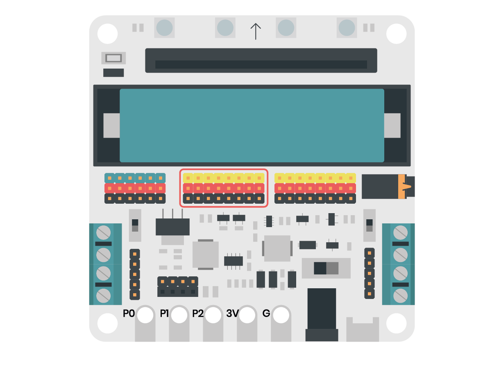

Programació d'elements en els diferents connectors
=====

Per utilitzar els pins d'entrada o sortida digital podem utilitzar els pins indicats en la imatge.

Cada pin té el seu nom a la part superior, exemple P7. Els pins grocs funcionen amb un voltatge de 3,3V. Els pins blaus poden funcionar a 3,3V o 5V. Això es configura manualment a través de l'interruptor indicat.

.. image:: img/ee/interruptor3v5v.png
   :width: 400

Per programar aquestes entrades i sortides podem utilitzar els blocs de l'apartat pins. 

Entrades/sortides digitals
------------

- En aquest codi activem i desactivem la sortida durant 1 segon.

.. raw:: html

    
<iframe style="position:absolute;top:0;left:0;width:100%;height:100%;" src="https://makecode.microbit.org/#pub:S52713-24227-22573-24867" frameborder="0" sandbox="allow-popups allow-forms allow-scripts allow-same-origin"></iframe>

- En aquest  codi activem una sortida analògica en diferents valors. Cada valor està activat 1 segon.

.. raw:: html

    
<iframe style="position:absolute;top:0;left:0;width:100%;height:100%;" src="https://makecode.microbit.org/#pub:S19670-31236-15943-66773" frameborder="0" sandbox="allow-popups allow-forms allow-scripts allow-same-origin"></iframe>

Entrades/sortides analògiques
------------

- En aquest codi es mostra la lectura digital del pin 4 per la matriu de leds de la *micro:bit*.

.. raw:: html

    
<iframe style="position:absolute;top:0;left:0;width:100%;height:100%;" src="https://makecode.microbit.org/#pub:S49675-98734-36807-05767" frameborder="0" sandbox="allow-popups allow-forms allow-scripts allow-same-origin"></iframe>

- En aquest codi es mostra la lectura analògica del pin X per la matriu de leds de la *micro:bit*.

.. raw:: html

    
<iframe style="position:absolute;top:0;left:0;width:100%;height:100%;" src="https://makecode.microbit.org/#pub:S49961-50110-82631-10830" frameborder="0" sandbox="allow-popups allow-forms allow-scripts allow-same-origin"></iframe>

Servos
------------

Per utilitzar servos amb la placa *micro:shield* els connectarem als pins indicats en la imatge.

Els servos els podrem programar mitjançant els blocs de servo de l'apartat de pins o el bloc de servo de la llibreria *micro:shield*.

- Programa de moviment del servo en 3 posicions utilitzant blocs de l'apartat pins.

.. raw:: html

    
<iframe style="position:absolute;top:0;left:0;width:100%;height:100%;" src="https://makecode.microbit.org/#pub:S33456-86742-19084-67069" frameborder="0" sandbox="allow-popups allow-forms allow-scripts allow-same-origin"></iframe>

- Programa de moviment del servo en 3 posicions utilitzant blocs de la llibreria *microshield*.

.. raw:: html

    
<iframe style="position:absolute;top:0;left:0;width:100%;height:100%;" src="https://makecode.microbit.org/#pub:S44012-18279-39747-26306" frameborder="0" sandbox="allow-popups allow-forms allow-scripts allow-same-origin"></iframe>

Motor DC
------------

El motor DC es connecta a la *micro:shield* en els connectors indicats en la imatge.

La *micros:shield* disposa de quatre ports de M1 a M4 amb dos connectors etiquetats cada un amb els signes + o -. Els motors DC funcionen amb dos cables un negre i un vermell. Utilitzarem un tornavís pla per fixar els cables en el connector. Preferiblement, connectarem el cable vermell al connector amb el signe + i el cable negre en el connector amb el signe -.

(video/giff connectant els cables)

Per programar els motors haurem d'importar la llibreria de la *microshield*.

- Programa per activar el motor M1 en un sentit de gir.

.. raw:: html

    
<iframe style="position:absolute;top:0;left:0;width:100%;height:100%;" src="https://makecode.microbit.org/#pub:S47814-10736-83039-67625" frameborder="0" sandbox="allow-popups allow-forms allow-scripts allow-same-origin"></iframe>

- Programa per aturar el motor M1.

.. raw:: html

    
<iframe style="position:absolute;top:0;left:0;width:100%;height:100%;" src="https://makecode.microbit.org/#pub:S15843-75792-68909-92857" frameborder="0" sandbox="allow-popups allow-forms allow-scripts allow-same-origin"></iframe>

- Programa que activa el motor M1 en un sentit de gir durant un segon, l'atura durant un segon i l'activa en l'altre sentit de gir durant un segon.

.. raw:: html

    
<iframe style="position:absolute;top:0;left:0;width:100%;height:100%;" src="https://makecode.microbit.org/#pub:S86504-64673-15200-58473" frameborder="0" sandbox="allow-popups allow-forms allow-scripts allow-same-origin"></iframe>

Motor pas a pas
------------

El motor pas a pas es connecta a la *micro:shield* en els connectors indicats en la imatge.

.. image:: img/ee/motorspasapas.png
   :width: 400

La *micros:shield* disposa de dos connectors de motor pas a pas. 

Per programar els motors haurem d'importar la llibreria de la *micro:shield*.

- Programa per fer girar el motor 90º.

.. raw:: html

    
<iframe style="position:absolute;top:0;left:0;width:100%;height:100%;" src="https://makecode.microbit.org/#pub:S30004-38568-99007-75409" frameborder="0" sandbox="allow-popups allow-forms allow-scripts allow-same-origin"></iframe>

- Programa per fer girar el motor 180 passos.

.. raw:: html

    
<iframe style="position:absolute;top:0;left:0;width:100%;height:100%;" src="https://makecode.microbit.org/#pub:S70501-56596-65702-37383" frameborder="0" sandbox="allow-popups allow-forms allow-scripts allow-same-origin"></iframe>

I2C
------------

Els components I2C es poden connectar en els connectors indicats en la imatge.

.. image:: img/ee/connectorI2C.png
   :width: 400

Depenent del component utilitzat s'haurà d'importar la seva pròpia llibreria per poder programar-lo.
